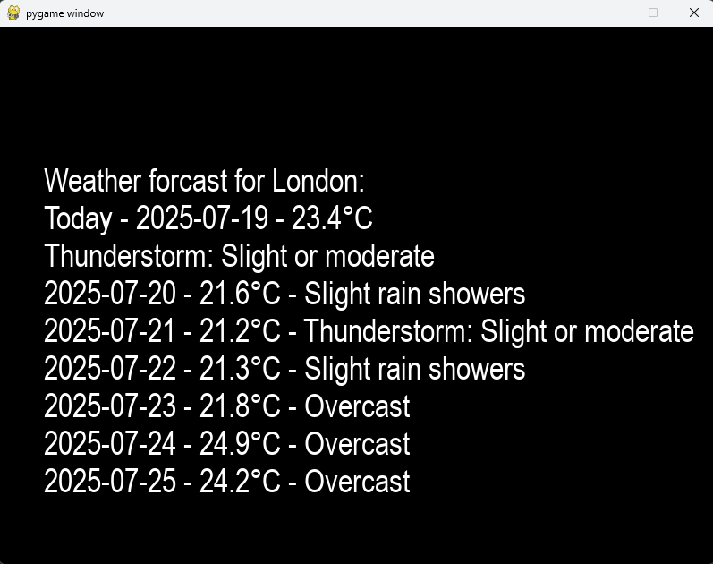

# 🗣️ Bop: Voice Commands

Bop is able to response to a number of voice commands, as long as a USB mic is installed
on the `bop_sense` running Pi.

It uses the Google Speech Recognition API to translate speech to text.

Reactions are limited right now and tested mainly using a Windows PC running Docker as the MQTT broker,
but testing on the real Pi based architecture is underway.

---

## ⚙️ Setting up for Voice commands

To set up for voice commands, ensure that:

- The relevant `.env` file for the environment being used has the key `MIC_INSTALLED` set to `true`
- A USB microphone is installed.
- The `bop_sense` Pi has internet access (need for reaching the Google API)

With these in place, running `bop_sense` should confirm that the microphone services have been started.

```
hardware_detection.services.hardware_config_service - INFO - [🔧 HardwareConfigService] Device Configuration:
hardware_detection.services.hardware_config_service - INFO - [🔧 HardwareConfigService] MIC IS ENABLED
hardware_detection.helpers.services_startup_helper - INFO - [🤖 MAIN] Bop sense config says we have a MIC enabled!
hardware_detection.helpers.services_startup_helper - INFO - [🤖 MAIN] Bop sense is trying to start services for the MIC
hardware_detection.helpers.services_startup_helper - INFO - [🤖 MAIN] Bop sense started the VOICE service!
```

---

## 💬 Using Voice Commands

When the above-mentioned output has been observed, Bop will start listening for the keyword of "listen".
```
mic.voice_listener - INFO - [💬 VoiceListener] Bop is listening for the keyword: listen
```

Upon hearing this word, a 10-second window will be opened. 
During this time, data will be placed into the queue for sending to `bop_brain`.

The keyword being heard and the window being opened will be confirmed by Bop:
```
mic.voice_listener - INFO - [💬 VoiceListener] Bop heard the keyword - Starting to listen.
mic.voice_listener - INFO - [💬 VoiceListener] Bop is in the listening window    
```

Words heard and sent to the queue will also be confirmed:
```
mic.voice_listener - INFO - [💬 VoiceListener] Bop Listened and heard: love - Publishing!
```

If the full Bop system is running and the spoken words trigger an event from `bop_brain`, you should see any reactions take place.

If the broker is not running or `bop_brain` isn't running then `bop_sense` will fall back to using a Mock Producer.


---
## 📡 Current Voice Command Reactions

As long as Bop is fully up and running and the hardware required for reacting to a voice command is present, 
the following commands should invoke the listed reactions.


| Command Contains Word | Hardware Needed (Other than Mic) | Reaction Expected                    |
|-----------------------|----------------------------------|--------------------------------------|
| `love`                | HDMI Screen on `bop_body`        | Screen will display "Bop is in love" |
| `angry`               | HDMI Screen on `bop_body`        | Screen will display "Bop is angry"   |
| `sad`                 | HDMI Screen on `bop_body`        | Screen will display "Bop is sad"     |                          |
| `happy`               | HDMI Screen on `bop_body`        | Screen will display "Bop is happy"   |
| `dance`               | HDMI Screen on `bop_body`        | Screen will display "Bop is dancing" |

### 🌡️ Weather reports

Bop can also generate a weather report - This requires a little bit of setup:

- An API key must be present in the `.env` file for `bop_brain` - This is for Geo IP Resolution and is free to obtain from [app.ipgeolocation.io](https://app.ipgeolocation.io/signup)
```
IP_GEOLOCATION_API_KEY=YOUR_API_KEY
```
In the future, this requirement will not be needed if `bop_brain` has GPS installed.

In order to generate a weather report:

- Ensure Bop is listening.
- Give Bop a command that contains `weather` or `forecast`

This should result in Bop gaining a weather report from [OpenMeteo](https://open-meteo.com/) and displaying it on the HDMI screen attached to `bop_body`



The report is very basic now and will be improved in the future.

---

## 🔮 The future

- I will continue to add more voice commands in the future, including news reports, quiz's and photographs taken by the camera.
- I will look to improve the accuracy of the recognition where possible, by tweaking the Google Api settings.
- I may offer an interface to use an alternative service, such as those offered by Azure or AWS.
